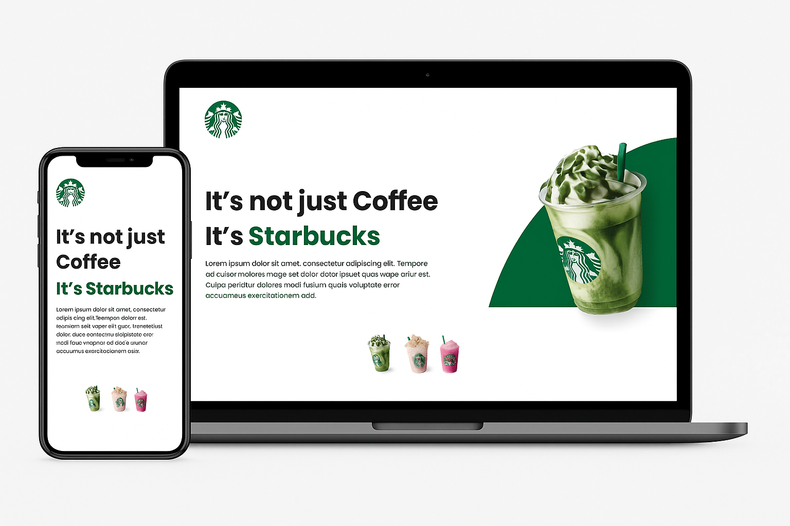

# ☕ Starbucks Landing Page

Projeto de página promocional inspirado no visual do Starbucks. Desenvolvido como exercício de HTML, CSS e responsividade para praticar estruturação de layout moderno, responsivo e atrativo.

---

## 🖼️ Demonstração



---

## 🚀 Tecnologias Utilizadas

- HTML5
- CSS3
- Responsividade com Media Queries
- Fontes personalizadas (Google Fonts)
- Imagens otimizadas (PNG)

---

## 📱 Responsivo

A página foi desenvolvida com foco em **responsividade**, adaptando-se para telas de desktop, tablets e smartphones.

---

## 📂 Estrutura do Projeto

```bash
├── index.html
├── style.css
├── assets/
│   ├── images/
│   │   ├── starbucks-desktop.png
│   │   └── starbucks-mobile.png
│   └── fonts/
└── README.md
